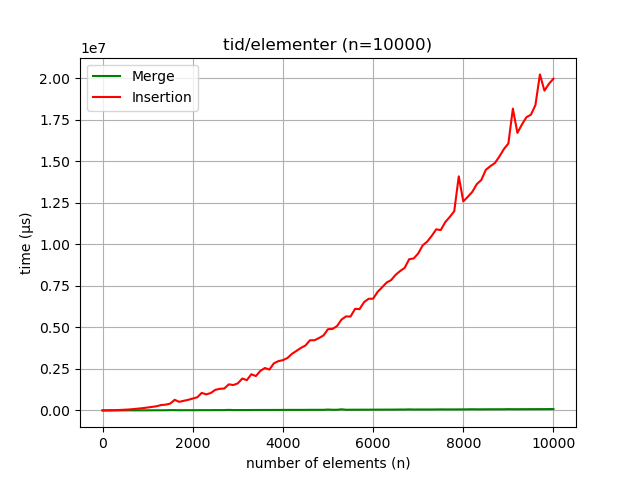

# IN2010 oblig 1 - halvorin

## Teque

(a)
pseudokode for en array-basert implementasjon, `collection[]`

```
function push_back(element)
   collection.append(element)

```

```
function push_front(element)
   collection.insert(0,element)

```

```
function push_middle(element)
   collection.insert(⌊|collection|/2⌋, element)

```

```
function get(index)
   print(collection[index])
```

b)
kjørbar i `python3 teque/teque.py`

c)

- push_back(): enkel tilordning. O(1)
- push_front():enkel tilordning. O(1)
- push_middle(): enkel tilordning. O(1)
- get(): oppslag i array. O(1)

d) med ubegrenset input-størrelse kan vi redusere konstanter, som 10^6^ til 1, og kun se på det største leddet. Dette lar oss få et grovere overblikk over kjøretid, og er betraktelig enklere å analysere.

## Sortering

MergeSort og InsertionSort er implementert i hhv. `sortering/python-src/merge.py` og `sortering/python-src/insertion.py`, og csv-filene genereres med `python3 sortering/python-src/main.py [FILENAME]`.

_grafer kan plottes vha. plotter.py i samme mappe. programmet tar sti til en .csv som argument, men aksetitler mm. må konfigureres i filen_

### spørsmål fra eksperimenter

- Q: I hvilken grad stemmer kjøretiden overens med kjøretidsanalysene (store
  O) for de ulike algoritmene?

  A: kjøretiden stemmer godt. graf 1 viser kjøretid avhengig av antall elementer, og selv med et lite datasett kan man tydelig se at insertion vokser kvadratisk. Det er vanskeligere å lese av stigningsgraden til merge-sort, da denne vil se lineær ut i forhold til insertion.

  

  [graf 1]

- Q: Hvordan er antall sammenligninger og antall bytter korrelert med kjøre-
  tiden?

  A: swaps og sammenligninger vokser i lik takt for insertion-sort, lineært.

  

  [graf 2]

- Q: Hvilke sorteringsalgoritmer utmerker seg positivt når n er veldig liten?
  Og når n er veldig stor?

  A: ved svært små n kan insertion være raskere enn merge-sort, som man kan se tidlig i graf 1, men merge-sort vil fort bli mer effektiv når n blir større.

- Q: Hvilke sorteringsalgoritmer utmerker seg positivt for de ulike inputfile-
  ne?

  A: Mens merge-sort er raskere for store tilfeldige input-filer, vil insertion-sort være raskere for 'nearly_sorted'-filene, slik vist i graf 3.

  

  [graf 3]

- Q: Har du noen overraskende funn å rapportere?

  A: Jeg synes det er overraskende å se forskjellen i hvor effektiv insertion-sort er avhengig av om det er et tilfeldig eller et nesten sortert datasett. Dette er veldig tydelig når man ser på grafer med samme størrelse, graf 1 og graf 4. i graf 4 er merge-sort praktisk talt flat i forhold til insertion-sort, mens i graf 3 vokser insertion tilsynelatende lineært med et lavere stigningstall en merge.

  

  [graf 4]
