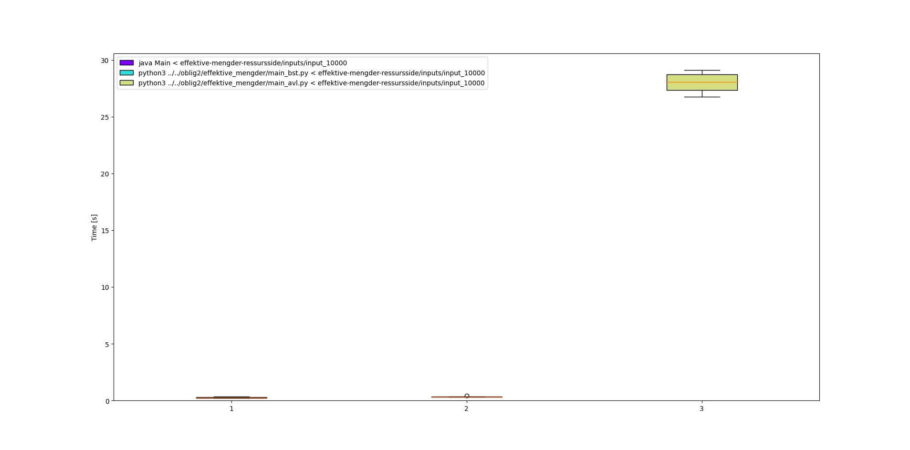

# IN2010 oblig 4 - halvorin

## effektive mengder med hashing.

##### a)

kjørbar i `effektive_mengder/Main`

##### b)

Min implementasjon av set via hashing er raskere enn implementasjonen med et binært søketre, og **betydelig** raskere enn implementasjonen med avl-tre.

magnitudforskjellen mellom de to førstnevnte og avl-treet gjør at å plotte resultatet er litt upraktisk:

dataene for plottet er de samme som i tabellen under.

> _alle data for gjennomsnittlig kjøretid er generert med [hyperfine](https://github.com/sharkdp/hyperfine)_

## Kattunge!

kjørbar i `kattunge/kattunge.py`
